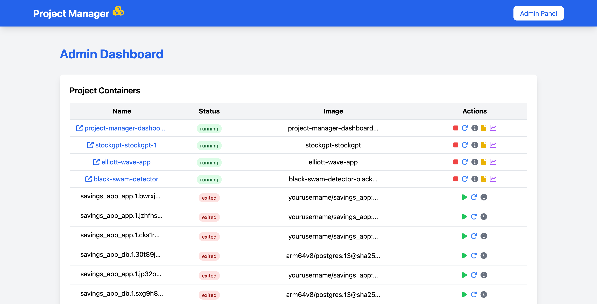

# Project Manager Dashboard

A modern, beautiful dashboard to manage all your Dockerized projects from any computer or server.

---

✨ **Made with ❤️ by [@esjavadex](https://github.com/esjavadex)** ✨

---

## Features
- Gorgeous landing page
- Admin panel with project management
- Docker container control interface
- Responsive design (works on mobile)
- Works on any Linux, Mac, or Windows machine with Docker
- Completely hardware-agnostic – works on any Linux, Mac, or Windows server.

## Technologies
- Python Flask backend
- Tailwind CSS for styling
- Docker API integration
- SQLite database (for user auth)

## Why This Dashboard Is Awesome

Project Manager Dashboard is designed to be the single pane of glass for all your Docker containers, wherever they run. With real-time monitoring, one-click controls, and seamless discovery of running services, you never need to switch contexts or memorize complex Docker commands.

• **Instant Visibility**: Live CPU, memory, disk, and network usage keeps you informed about container and system health. No more guessing at logs or metrics – everything is displayed in easy-to-read charts and tables.

• **Built-in Logs & Stats**: View the last 100 log lines directly in the UI, refresh on demand, or tail logs in real time. Detailed stats (CPU %, memory %, network I/O) update automatically to catch issues before they escalate.

• **Safe & Fast Control**: Start, stop, or restart containers with a single click. Confirmation modals prevent accidental downtime, while toast notifications keep you informed of successes or errors.

• **Extensible & Developer-Friendly**: Powered by Flask, Docker SDK, and psutil, you can customize or extend the backend API. Tailwind CSS ensures the frontend is clean, performant, and easy to theme.

• **Cross-Platform & Mobile-Ready**: The responsive design adapts to any screen size, so you can manage containers from your desktop, tablet, or phone without losing functionality.

## Screenshots

### Landing Page


### Admin Panel


### Container Details Modal


### Logs Modal


## Requirements

- Python 3.9 or higher
- Docker Engine (19.03+)
- Docker Compose (for local development)
- Flask 2.3.2
- Flask-SQLAlchemy 3.0.3
- Flask-Login 0.6.2
- Docker SDK for Python 6.1.3
- python-dotenv 1.0.0
- psutil 5.9.5
- Tailwind CSS (included via static files or CDN)
- Modern web browser (Chrome, Firefox, Safari, Edge)
- Node.js & npm (optional, for building frontend assets)

## Security Features

- **Admin Password via Environment Variable**: Set the initial admin password using the `ADMIN_PASSWORD` variable in your `.env` file. If not set, defaults to `1234admin`.
- **Password Hashing**: All passwords are securely hashed using Werkzeug.
- **Login Rate Limiting**: Only 5 login attempts are allowed per 10 minutes per IP address to prevent brute-force attacks.
- **User Roles**: `admin` (full access), `operator` (manage containers), `read-only` (view only).
- **Session "Remember Me"**: Option to stay logged in securely.
- **Database Not in Git**: The database file is excluded from version control for privacy.


## Setup
1. Clone this repository
2. Run `pip install -r requirements.txt`
3. Configure `.env` file (see below)
4. Run `python app.py`

### Example `.env` file
```
FLASK_SECRET_KEY=your-secret-key-here
FLASK_DEBUG=True
DOCKER_API_VERSION=1.41
ADMIN_PASSWORD=your_admin_password_here
```


## Docker Setup
1. Build the image: `docker-compose build`
2. Run the container: `docker-compose up`
3. Access the app at: http://localhost:5000

**Note**: The container needs access to your host's Docker daemon to manage other containers.
